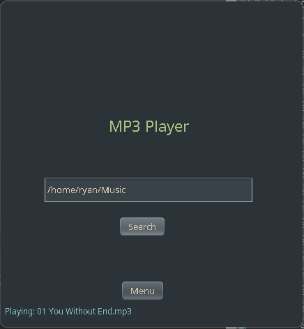
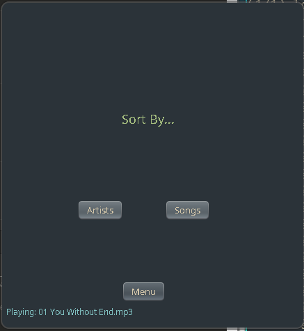

# Mp3 Player

## Usage
```
# Compile the project
make compile

# Compile and run
make run

# Clean up compiled files
make clean

# Install to ~/.local/bin/mp3
make install

# Run program
mp3

# Uninstall from ~/.local/bin
make uninstall
```

## Screenshots

### Searching for music in a directory
Searches the given directory and all subdirectories for Mp3 files.
Defaults to `$HOME/Music`


### Sorting contents by song/artist



### Song selection, play, start, stop


