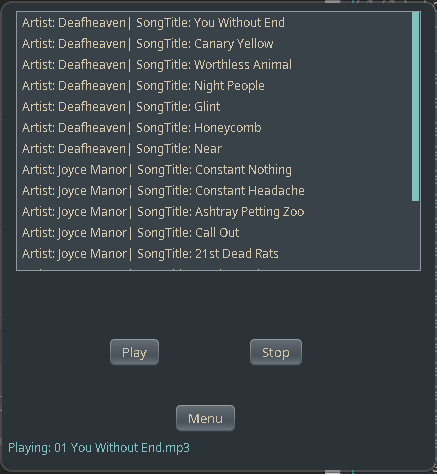

# Mp3 Player

## Dependencies

### Runtime
- `mpg123` - MP3 playback engine
- `pulseaudio` or `pipewire-pulse` - Audio output

### Build
- `jdk-openjdk` (Java 17+)
- JAR libraries (included in `lib/`):
  - `jl1.0.1.jar`
  - `jaudiotagger-2.2.6-SNAPSHOT.jar`

### Installation (Arch Linux)
```bash
sudo pacman -S jdk-openjdk mpg123 pipewire pipewire-pulse
```

## Usage
```
# Compile the project
make compile

# Compile and run
make run

# Clean up compiled files
make clean

# Install to ~/.local/bin/mp3
make install

# Run program
mp3-player

# Uninstall from ~/.local/bin
make uninstall
```

## Screenshots

### Searching for music in a directory
Searches the given directory and all subdirectories for Mp3 files.
Defaults to `$HOME/Music`


### Sorting contents by song/artist


### Song selection, play, start, stop


